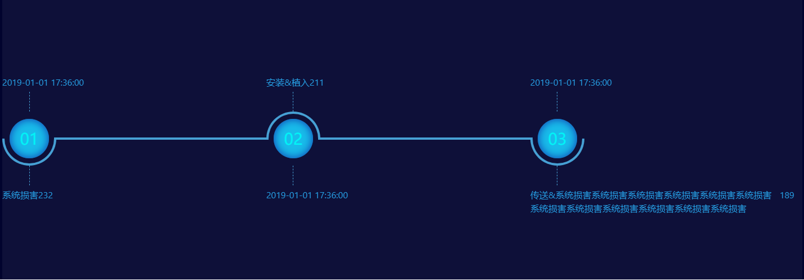

# v-custom-steps 步骤条

```
let widgetData =[
  {
    "key": "2019-01-01 17:36:00",
    "name": "系统损害",
    "value": 232
  },
  {
    "key": "2019-01-01 17:36:00",
    "name": "安装&植入",
    "value": 211
  },
  {
    "key": "2019-01-01 17:36:00",
    "name": "传送&系统损害系统损害系统损害系统损害系统损害系统损害系统损害系统损害系统损害系统损害系统损害系统损害",
    "value": 189
  }
]
let oDataAnyone =[
  {
    "name": "系统损害",
    "value": 232
  },
  {
    "name": "安装&植入",
    "value": 211
  },
  {
    "name": "传送&系统损害系统损害系统损害系统损害系统损害系统损害系统损害系统损害系统损害系统损害系统损害系统损害",
    "value": 189
  }
]

```

引导用户按照流程完成任务的分步导航条，可根据实际应用场景设定步骤，步骤尽量不少于 2 步。
`注意 该组件是要是使用flex布局，因此有兼容性问题`
## 基础用法
>步骤条组件, 仅需传递 <code>data</code>即可。

```html
    <el-row  type="flex" justify="center"  style="height: 600px;  background:rgba(1, 3, 46, 1)" >
      <el-col :span="16">
       <idss-db-step :data='widgetData' style='background: rgba(255,255,255,0.05)'>
       </idss-db-step>
      </el-col>
    </el-row>
```

**如下图:**


### 横竖式步骤条

需要指定`direction`的值、分别为`horizontal`是水平方向，`'vertical'`是垂直方向，默认的是垂直
```html
<el-row  style="height: 500px;  background:rgba(1, 3, 46, 1)">
  <el-col :span="12"  style="height:100%; border-right: 1px dashed darkviolet;">
  <idss-db-step  :data="widgetData"    direction="horizontal" style='background: rgba(255,255,255,0.05)'></idss-db-step>
  </el-col>
  <el-col :span="12" style="height:100%; ">
  <idss-db-step  :data="widgetData" direction="vertical" style='background: rgba(255,255,255,0.05)'></idss-db-step>
  </el-col>
</el-row>
```
**如下图:**


## 设置每个步骤条的间距

用设置 <code>space='200'</code>来设置步长，每个 step 的间距，不填写将自适应间距。支持百分比。

```html
    <el-row class='mypage' type="flex" justify="center"  style="height: 500px;  background:rgba(1, 3, 46, 1)" >
      <el-col :span="20">
       <idss-db-step :data='widgetData'  space='33%'  direction="horizontal" style='background: rgba(255,255,255,0.05)'>
       </idss-db-step>
      </el-col>
    </el-row>
```

**如下图:**



##  theme换肤步骤条

设置 <code>theme='#800080'</code>来换肤，configStyle和theme都设置的时候优先configStyle。

```html
    <el-row class='mypage' type="flex" justify="center"  style="height: 500px;  background:rgba(1, 3, 46, 1)" >
      <el-col :span="20">
       <idss-db-step :data='widgetData'   theme="#1890ff"  :configStyle='config2'  direction="horizontal" style='background: rgba(255,255,255,0.05)'>
       </idss-db-step>
      </el-col>
    </el-row>
<script>
 export default {
  data() {
    return {
      config2:{
          circleStyle:{
            color: 'rgb(239, 13, 239)'
          }
      },
    }
  },

}
</script>
```
**如下图:**


## 居中的步骤条

`align-center` 文字是否居中  只对布局为   `direction="horizontal" ` 时生效

```html
    <el-row class='mypage' type="flex" justify="center"  style="height: 500px;  background:rgba(1, 3, 46, 1)" >
      <el-col :span="20">
       <idss-db-step :data='widgetData'  align-center  direction="horizontal" style='background: rgba(255,255,255,0.05)'>
       </idss-db-step>
      </el-col>
    </el-row>
```
**如下图:**


## 步骤条的样式和事件

设置`configStyle`可以对步骤条上的dom更改样式，通过`@clickItem="testClick" `来处理点击事件，注意修改 `mediumLineStyle`中线的宽的的时候也要相对应的改变圆的大小

```html
    <el-row class='mypage' type="flex" justify="center"  style="height: 500px;  background:rgba(1, 3, 46, 1)" >
      <el-col :span="20">
       <idss-db-step :data='widgetData'  @clickItem="testClick"   :configStyle='config1'   direction="horizontal" style='background: rgba(255,255,255,0.05)'>
       </idss-db-step>
      </el-col>
    </el-row>
    <script>
 export default {
  data() {
    return {
      config1:{
        // 中线的样式
         mediumLineStyle: {
            color: '#fff',
            width: '8px'
          },
          // 圆左右两边的线样式
          nodeLineStyle: {
            color: 'yellow'
          },
          // 文字的样式
          textStyle: {
            color: 'green'
          },
          // 圆的样式
          circleStyle: {
            width: '100px',
            height: '100px',
            lineHeight: '100px',
            backgroundColor: 'pink',
            boxShadow: '0px 0px 15px orange inset',
            color: 'purple'
          }
      },
    }
  },
  methods: {
    testClick(e, item, index) {
        console.log('点击操作~~', e, item, index)
    }
  }
}
</script>
```
**如下图:**


## 步骤条错位展示

 错位展示的时候主要是数据格式` data`的差别

```html
    <el-row class='mypage' type="flex" justify="center"  style="height: 500px;  background:rgba(1, 3, 46, 1)" >
      <el-col :span="20">
       <idss-db-step :data='oDataAnyone'   direction="horizontal" style='background: rgba(255,255,255,0.05)'>
       </idss-db-step>
      </el-col>
    </el-row>
```
**如下图:**


## 插槽事列

 注意多个插槽展示内容时插槽名称为`插槽名称+插槽位置`，详情看事列
```html
    <el-row class='mypage' type="flex" justify="center"  style="height: 800px;  background:rgba(1, 3, 46, 1)" >
      <el-col :span="20">
       <idss-db-step :data='widgetData'   style='background: rgba(255,255,255,0.05);color:#fff' >
         <template slot='key0'><span style='font-size:30px'>我是插槽key1的内容</span></template>
         <template slot='key1'><span>我是插槽key2的内容</span></template>
         <template slot='key2'><span>我是插槽key3的内容</span></template>
         <template slot='value0'><span>插槽value1的内容</span></template>
         <template slot='value1'><span>插槽value2的内容</span></template>
         <template slot='value2'><span>插槽value3的内容</span></template>
         <template slot='step0'><span>111</span></template>
         <template slot='step1'><span>222</span></template>
         <template slot='step2'><span>333</span></template>
       </idss-db-step>
      </el-col>
    </el-row>
```
**如下图:**


## Props

| 参数         | 说明                                                   | 类型      | 可选值                | 默认值                      |
| ------------ | ------------------------------------------------------ | --------- | --------------------- | --------------------------- |
| data         | 数据                                                   | `Array`   | -                     | []                          |
| direction    | 攻击链方向                                             | `String`  | `horizontal/vertical` | `vertical`                  |
| configStyle  | 样式配置项,`注意`: 外部传入值会与默认值进行`merge`操作 | `Object`  | ---                   | `具体配置见下方configStyle` |
| space        | 每个 step 的间距，不填写将自适应间距。支持百分比。     | `String`  | ---                   | --                          |
| theme        | 主题色                                                 | `String`  | ---                   | ''                          |
| align-center | 文字是否居中 只对 direction="horizontal"  时生效       | `Boolean` | `true/false`          | `false`                     |

## configStyle
| 参数            | 说明               | 类型     | 可选值 | 默认值                                   |
| --------------- | ------------------ | -------- | ------ | ---------------------------------------- |
| mediumLineStyle | 中线样式           | `Object` | ---    | `{  color: '#46A0D4', width: '4px' }`    |
| nodeLineStyle   | 圆左右两边的线样式 | `Object` | ---    | `{ color: '#46A0D4' }`                   |
| textStyle       | 文字的样式         | `Object` | ---    | `{ fontSize: '16px',color: ' #259ee3' }` |
| circleStyle     | 圆的样式           | `Object` | ---    |                                          |


## Events

| 事件名称  | 说明                   | 回调参数                                     |
| --------- | ---------------------- | -------------------------------------------- |
| clickItem | 点击步骤条具体节点触发 | e(事件对象)item（当前项）, index（当前索引） |

## Slots

| name  | 说明                                                 |
| ----- | ---------------------------------------------------- |
| key   | 通过 `slot='"key"+index'`设置每一个节点key的内容     |
| value | 通过 `slot='"value"+index'`设置每一个节点value的内容 |
| step  | 通过 `slot='"step"+index'`设置每一个节点的内容 |


## Build Setup

``` bash
# install dependencies
npm install

# serve with hot reload at localhost:8080
npm run dev

# build for production with minification
npm run build
```

For detailed explanation on how things work, consult the [docs for vue-loader](http://vuejs.github.io/vue-loader).


